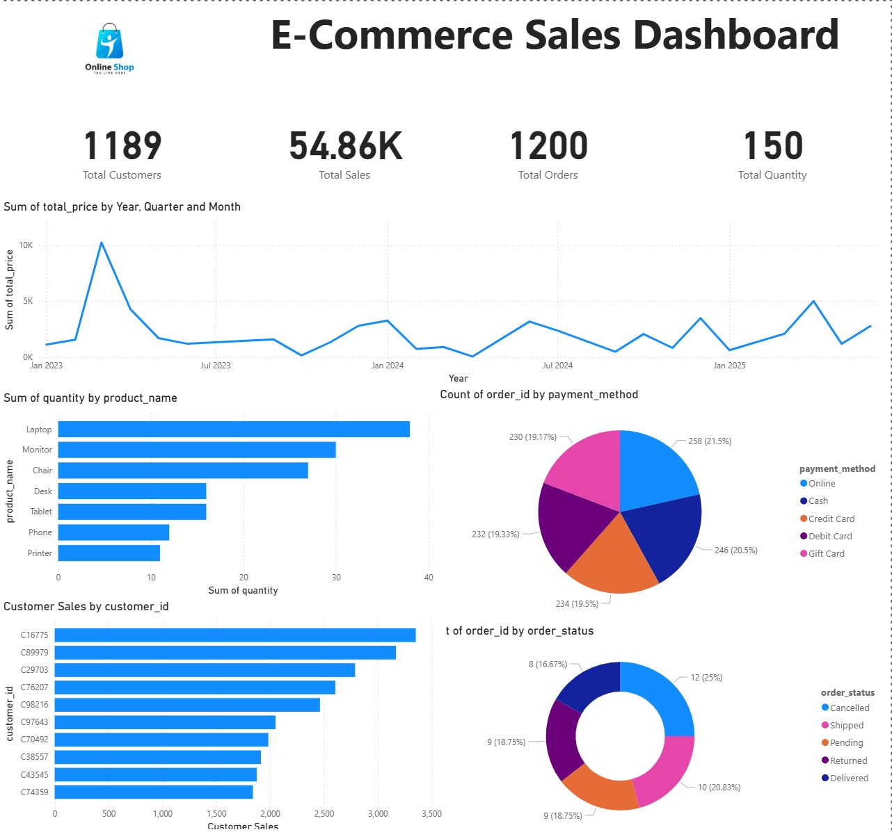
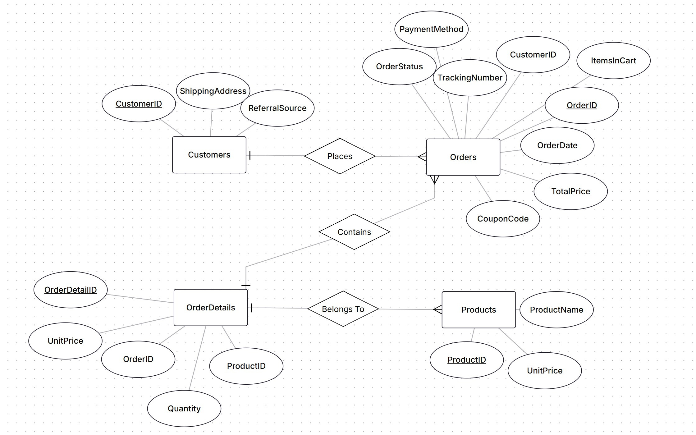

 # E-Commerce Analytics Dashboard

## Project Overview
This project analyzes e-commerce sales data to uncover business insights and improve decision-making.

## Tools Used
- Python
- Pandas
- SQL Server
- Power BI
- Jupyter Notebook

## Project Workflow
1. Data Cleaning using Python
2. Database Design (ERD)
3. SQL Data Modeling
4. Dashboard Development in Power BI

## Dashboard Preview

## ERD

## Files Included
- ecommerce_dataset.xlsx
- data_cleaning.ipynb
- database.sql
- Power BI Dashboard.pbix

## Key Insights
- Top-selling products
- Monthly sales trends
- Customer behavior analysis
- Revenue performance analysis
